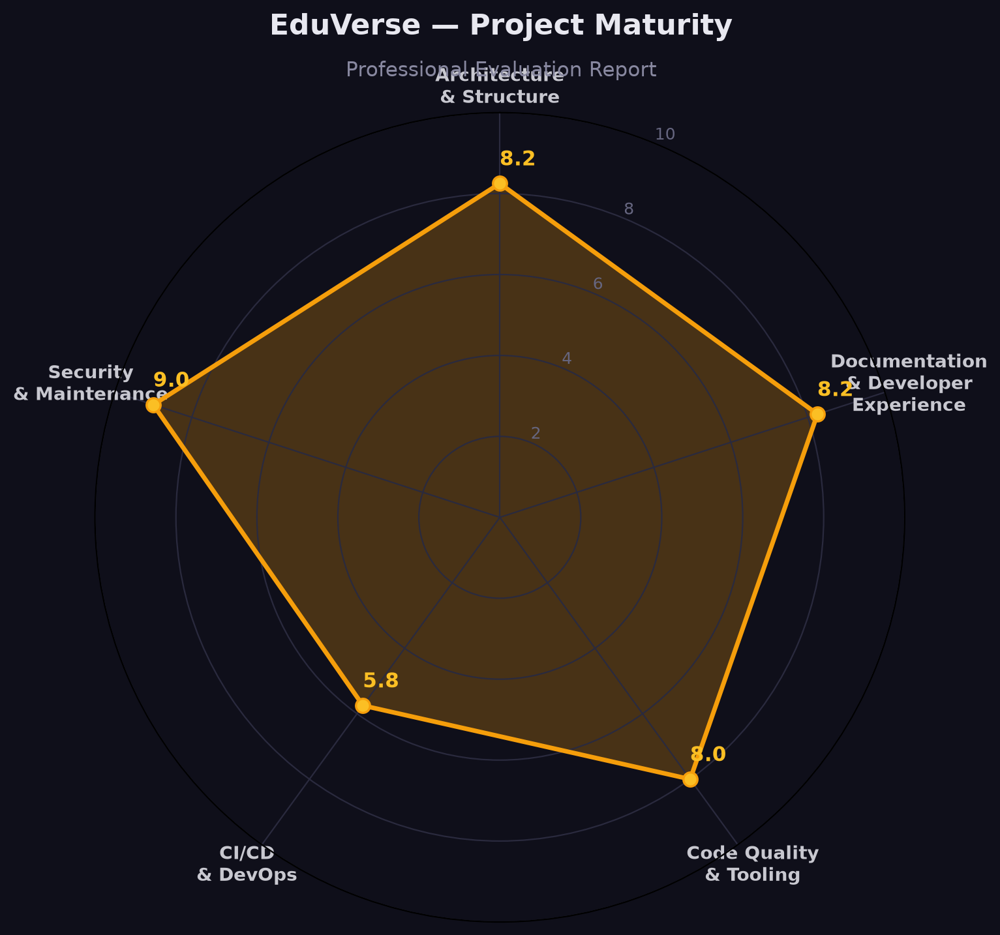
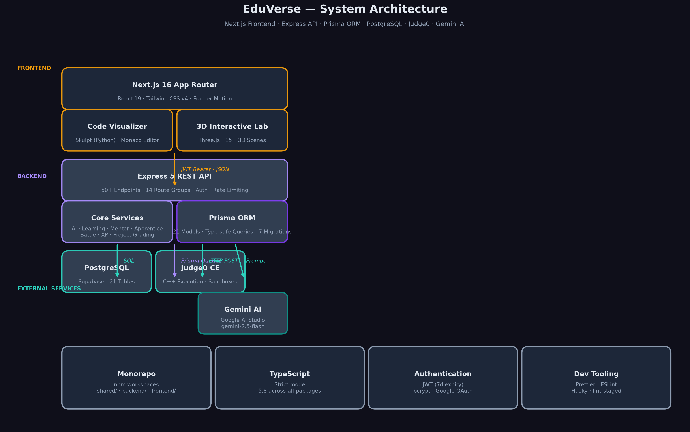

# EduVerse Student Platform — Professional Evaluation Report

  

This report evaluates the EduVerse Student Platform repository against industry-standard "pro" benchmarks for open-source and enterprise-grade software.

---

## 1. Project Architecture & Structure

| Component            | Rating       | Observations                                                                                                                                                |
| -------------------- | ------------ | ----------------------------------------------------------------------------------------------------------------------------------------------------------- |
| **Monorepo Design**  | 🟢 Excellent | Uses npm workspaces effectively. Clean separation between `frontend`, `backend`, and `shared` logic.                                                        |
| **Frontend Stack**   | 🟢 Excellent | Modern Next.js 16 App Router, TypeScript strict mode, Tailwind CSS 4, and Framer Motion.                                                                    |
| **Backend Stack**    | 🟡 Good      | Express with TypeScript and Prisma. Solid, but lacks a structured controller/dependency injection pattern common in larger "pro" apps (e.g., NestJS style). |
| **Shared Workspace** | 🟢 Excellent | Centralizes types and logic, preventing duplication across the stack.                                                                                       |

  

---

## 2. Documentation & Developer Experience (DX)

| Dimension               | Rating       | Recommendation                                                                                                                                   |
| ----------------------- | ------------ | ------------------------------------------------------------------------------------------------------------------------------------------------ |
| **README**              | 🟢 Excellent | Very detailed, visual, and well-structured.                                                                                                      |
| **Documentation Depth** | 🟢 Excellent | Extensive `/docs` folder covering architecture, database, and specific features.                                                                 |
| **Setup Process**       | 🟡 Good      | `db:setup` is helpful, but relies on external services (Supabase, Judge0, Google AI) without a local-first fallback (e.g., Dockerized Postgres). |
| **Onboarding**          | 🟢 Excellent | Clear contribution guidelines, issue templates, and pull request templates.                                                                      |

---

## 3. Code Quality & Tooling

| Tooling        | Status        | Observations                                                                                           |
| -------------- | ------------- | ------------------------------------------------------------------------------------------------------ |
| **TypeScript** | 🟢 Strict     | Properly configured `tsconfig` with no-emit checks in CI.                                              |
| **Linting**    | 🟡 Partial    | ESLint is present in frontend but was missing/unconfigured in the root for consistent backend linting. |
| **Formatting** | 🟢 Configured | Prettier is configured and enforced via CI.                                                            |

---

## 4. CI/CD & DevOps

| Feature            | Status        | Recommendation                                                                                                              |
| ------------------ | ------------- | --------------------------------------------------------------------------------------------------------------------------- |
| **Git Hooks**      | 🔴 Missing    | Husky is in `package.json` but was not initialized or configured with `lint-staged`.                                        |
| **GitHub Actions** | 🟢 Active     | `ci.yml` covers build, type-check, and Prisma validation.                                                                   |
| **Testing**        | 🟡 Minimal    | E2E scripts exist but are manual/script-based rather than integrated into a standard test runner like Playwright or Vitest. |
| **Docker**         | 🟡 Incomplete | `docker-compose.yml` exists but frontend Dockerfile is isolated; lacks a unified production container strategy.             |

---

## 5. Security & Maintenance

| Dimension        | Rating     | Observations                                                             |
| ---------------- | ---------- | ------------------------------------------------------------------------ |
| **Secrets**      | 🟢 Secure  | `.env.example` is comprehensive; no secrets detected in history.         |
| **Dependencies** | 🟢 Modern  | Uses latest versions of React (19), Next.js (16), and Prisma (6).        |
| **Policies**     | 🟢 Present | `SECURITY.md`, `CODE_OF_CONDUCT.md`, and `LICENSE` are all professional. |

---

## 6. Summary of Improvements Needed for "Pro" Status

1. **Unified Tooling:** Extend ESLint to the backend and root workspace.
2. **Automation:** Configure Husky and lint-staged to prevent bad commits.
3. **CI Enhancement:** Integrate the E2E scripts into the GitHub Actions pipeline.
4. **Dev Environment:** Add a `docker-compose` for local PostgreSQL to enable "one-click" development without Supabase.
5. **Testing Framework:** Transition manual `.mjs` test scripts to a formal framework (e.g., Vitest or Playwright).

---

_Report generated by Manus AI · June 2026_
