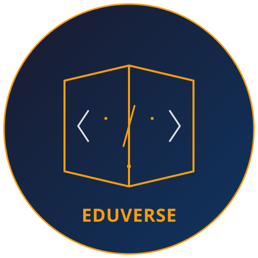
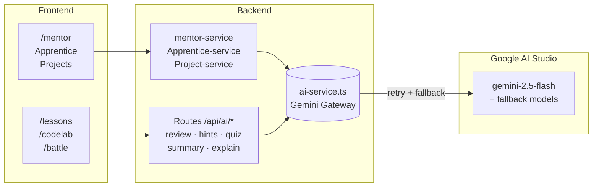

<div align="center">
  
  <h1 align="center">EduVerse</h1>
  <p align="center">
    <strong>AI-powered, gamified learning platform — see your code run, line by line.</strong>
  </p>
  <p align="center">
    An open-source RPG adventure that transforms programming and academic education into
    an interactive journey. Personal AI mentor, skill tree, coding battles, 3D lab, and more.
  </p>
  <p align="center">
    <a href="#features">Features</a> ·
    <a href="#why-eduverse">Why EduVerse?</a> ·
    <a href="#quick-start">Quick Start</a> ·
    <a href="#architecture">Architecture</a> ·
    <a href="#showcase">Showcase</a> ·
    <a href="#documentation">Documentation</a> ·
    <a href="#contributing">Contributing</a>
  </p>
</div>

<br />

<p align="center">
  <a href="https://github.com/ahmed-progra/EduVerse-Student-Platform/actions">
    
  </a>
  <a href="LICENSE">
    
  </a>
  <a href="https://github.com/ahmed-progra/EduVerse-Student-Platform/issues">
    
  </a>
  <a href="https://github.com/ahmed-progra/EduVerse-Student-Platform/pulls">
    
  </a>
  
  
  
  <br />
  
  
  
  
  
  
  
  
  <br />
  <strong>7 courses · 172+ lessons · Python · HTML · CSS · C++ · Mathematics · Physics · Science</strong>
</p>

<br />

<p align="center">
  
</p>

---

## Why EduVerse?

Most learning platforms are **passive** — watch a video, read a doc, maybe answer a quiz. EduVerse is **active**:

- **Your code runs live** — step through Python line by line, watch variables change, see the call stack grow and shrink. No "compile and pray."
- **AI that knows what you've learned** — the mentor doesn't guess. It reads your skill profile, sees which topics you've mastered and which you haven't, then generates missions and recommendations that fit.
- **Every feature is a game mechanic** — XP, skill tree, battles, shop cosmetics, leaderboard rankings. But progression is tied to real learning, not mindless grinding.
- **Built by students, for students** — the UI is a warm dark "Code Sorcery" theme with purposeful motion, no fluff, and zero tutorial hand-holding.

---

## Features

- **Step-through Code Visualizer** — Watch Python execute line by line with live variable state; HTML/CSS render in a live preview; C++ runs via Judge0
- **AI Mentor** (`/mentor`) — Cross-course coach that tracks mastery, identifies weak topics, assigns daily missions, and produces weekly reports
- **Skill Tree** — Branching ability map across Python, frontend, algorithms, and debugging. Unlock nodes with XP and level requirements
- **Battle Arena** (`/battle`) — Timed coding duels with multiple difficulty levels and challenge types
- **3D Interactive Lab** (`/lab`) — Explore physics, math, computer science, chemistry, and electronics through Three.js interactive 3D scenes with live controls and readouts
- **Apprentice Teaching** (`/apprentice`) — Teach a novice AI called **Pip** — the protégé effect solidifies your own understanding
- **AI Project Studio** (`/projects`) — AI-suggested projects, in-app builder, AI grading against a rubric, and a public portfolio
- **Code Lab** (`/codelab`) — Monaco editor, live preview, and step visualizer for Python, HTML, and CSS
- **Placement Test** — Adaptive assessment that builds per-topic mastery and generates personalized roadmaps
- **Shop & Leaderboard** — Cosmetics bought with coins (separate from XP) + weekly and all-time rankings
- **Adaptive Daily Challenges** — Personalized exercises generated from your current mastery profile

---

## Quick Start

### Docker (one command)

```bash
docker compose up -d
```

Starts PostgreSQL, Judge0 (C++ runner), the Express backend, and the Next.js frontend.  
Frontend at **http://localhost:3000**, backend at **http://localhost:4000**.

> **Note:** AI features require a `GOOGLE_AI_API_KEY`. Set it in your `.env` or in the backend service environment in `docker-compose.yml`.

### Manual setup

```bash
git clone https://github.com/ahmed-progra/EduVerse-Student-Platform.git
cd EduVerse-Student-Platform

# Start PostgreSQL (requires Docker)
docker compose -f docker-compose.local.yml up -d

# Install dependencies
npm install

# Configure environment
cp .env.example .env
# Edit .env — set DATABASE_URL and DIRECT_URL for your PostgreSQL instance

# Setup database (migrate + seed)
npm run db:setup

# Start development servers (frontend :3000, backend :4000)
npm run dev
```

### Demo accounts

| Account | Email               | Password      | Description                  |
| ------- | ------------------- | ------------- | ---------------------------- |
| Demo    | `demo@eduverse.dev` | `demo1234`    | Intermediate Python, 500+ XP |
| Alice   | `alice@example.com` | `password123` | Fresh account, 0 XP          |

---

## Architecture

<p align="center">
  
</p>

### Workspaces

| Package     | Responsibility                                                                                                                    |
| ----------- | --------------------------------------------------------------------------------------------------------------------------------- |
| `frontend/` | Next.js 16 App Router — dashboard, courses, code lab, mentor, apprentice, battle, shop, leaderboard, 3D lab, user profiles        |
| `backend/`  | Express 5 REST API — auth, courses, lessons, AI services, battles, leaderboard, shop, project grading, skill tree, code execution |
| `shared/`   | TypeScript types and interfaces shared between frontend and backend (User, Course, Lesson, Battle, etc.)                          |

### AI Layer



### Code Execution

| Language   | Where            | How                                                 |
| ---------- | ---------------- | --------------------------------------------------- |
| Python     | Browser          | Skulpt — stepped execution with live variable state |
| HTML / CSS | Browser          | Sandboxed `<iframe>` live preview                   |
| C++        | Backend → Judge0 | Submitted via `services/judge0.ts`                  |

---

## Showcase

<p align="center">
  
  <br />
  <em>Maturity radar — EduVerse evaluated across 15 professional engineering criteria</em>
</p>

<br />

**Dashboard & Learning Path** — A unified dashboard shows XP progress, active missions, recent battles, and recommended next steps. Courses are presented as a structured path with visual progress tracking.

**Interactive Code Lab** — The Monaco editor runs alongside a step-through visualizer. Every line of Python executes in the browser via Skulpt, with live variable panels and call stack visualization. HTML and CSS render in a sandboxed iframe. C++ executes remotely via Judge0.

**3D Lab** — Seven interactive Three.js scenes covering physics, engineering, mathematics, computer science, chemistry, electronics, and biology. Each scene has live parameter controls, real-time readouts, and simulation-native charts.

**AI Mentor** — The mentor is context-aware: it reads the user's skill profile, identifies weak topics, generates missions targeting those gaps, and produces a weekly learning report with actionable insights.

**Apprentice Mode (Pip)** — The protégé effect reverses the learning dynamic. Users teach a novice AI named Pip by explaining concepts; the AI asks follow-up questions and the system grades the teaching quality.

---

## Tech Stack

| Category           | Technology                                                                           |
| ------------------ | ------------------------------------------------------------------------------------ |
| **Frontend**       | Next.js 16 (App Router), React 19, Framer Motion, Tailwind CSS v4, Zustand, Three.js |
| **Backend**        | Express 5, Prisma ORM, TypeScript, Zod validation                                    |
| **Database**       | PostgreSQL (Supabase), SQLite (local dev mirror)                                     |
| **AI**             | Google AI Studio — Gemini 2.5 Flash                                                  |
| **Code Editor**    | Monaco Editor (`@monaco-editor/react`)                                               |
| **Code Execution** | Skulpt (Python) · Judge0 (C++) · sandboxed iframe (HTML/CSS)                         |
| **Tooling**        | TypeScript 5.8, Prettier, ESLint, Husky, lint-staged, tsx watch                      |
| **Monorepo**       | npm workspaces (`frontend`, `backend`, `shared`)                                     |

---

## Project Structure

```
eduverse/
├── frontend/                          # Next.js 16 web application
│   ├── src/app/                       # App Router — 28 route segments
│   │   ├── dashboard/                 # Learner dashboard
│   │   ├── courses/                   # Course catalog + detail
│   │   ├── lessons/                   # Lesson viewer + code visualizer
│   │   ├── lab/                       # Interactive 3D lab
│   │   ├── codelab/                   # Code playground
│   │   ├── mentor/                    # AI Mentor dashboard
│   │   ├── apprentice/                # Teach the AI (Pip)
│   │   ├── projects/                  # Project studio + portfolio
│   │   ├── battle/                    # Coding battles
│   │   ├── leaderboard/               # Rankings
│   │   ├── shop/                      # Cosmetics shop
│   │   ├── skill-tree/                # Ability tree
│   │   ├── placement-test/            # Adaptive assessment
│   │   ├── resources/                 # Learning resources
│   │   ├── announcements/             # Bulletin board
│   │   ├── profile/                   # User profile
│   │   ├── auth/                      # Login + register
│   │   └── u/[username]/              # Public portfolio
│   ├── src/components/                # Shared UI + layout components
│   ├── src/features/                  # Feature modules (12 domains)
│   ├── src/hooks/                     # Custom React hooks
│   ├── src/lib/                       # Utilities + motion helpers
│   ├── src/services/                  # API client (cached, deduplicated)
│   ├── src/stores/                    # Zustand auth store
│   ├── src/types/                     # TypeScript declarations + API entity types
│   └── eslint.config.mjs              # Flat ESLint config
├── backend/                           # Express 5 REST API
│   ├── src/routes/                    # 15 route groups
│   ├── src/services/                  # AI, learning, mentor, apprentice, XP, battle, project
│   ├── src/middleware/                # JWT auth, rate limiting, error handling
│   ├── src/learning/                  # Topic catalogs, assessment banks
│   ├── src/lib/                       # Prisma client, JWT, validation, cache
│   ├── prisma/                        # Schema + migrations (7 migration sets)
│   ├── curriculum/                    # 172 authored lessons across 7 courses
│   └── scripts/                       # 6 E2E test suites
├── shared/src/                        # 20+ shared TypeScript types
├── docs/                              # Documentation (17 documents)
├── assets/                            # Logos, diagrams, social preview
├── .github/                           # CI, issue/PR templates, Dependabot
├── tools/                             # Developer tooling scripts
├── package.json                       # Root workspace orchestrator
└── tsconfig.base.json                 # Shared TypeScript config
```

## API Overview

The backend exposes **60+ REST endpoints** under `/api/*`. Key groups:

| Group       | Base Path                 | Endpoints                                                                                 |
| ----------- | ------------------------- | ----------------------------------------------------------------------------------------- |
| Auth        | `/api/auth`               | Register, login, Google OAuth, me                                                         |
| Courses     | `/api/courses`            | List courses, get course with progress                                                    |
| Lessons     | `/api/lessons`            | Get lesson, complete, submit quiz                                                         |
| AI          | `/api/ai`                 | Mentor chat, code review, hints, challenge, quiz, summary, recommendations, error explain |
| Learning    | `/api/learning/:courseId` | State, assessment start/submit, roadmap refresh                                           |
| Mentor      | `/api/mentor`             | Profile, sync, missions, reports, chat                                                    |
| Apprentice  | `/api/apprentice`         | Topics, start, reply, grade                                                               |
| Projects    | `/api/projects`           | CRUD, suggest, submit, portfolio                                                          |
| Battles     | `/api/battles`            | Create, join, submit, active, history                                                     |
| Skill Tree  | `/api/skilltree`          | Tree, unlock                                                                              |
| Leaderboard | `/api/leaderboard`        | Rankings, rank                                                                            |
| Shop        | `/api/shop`               | Items, buy, equip, inventory                                                              |
| User        | `/api/user`               | Profile, update, XP logs                                                                  |
| Submissions | `/api/submissions`        | Code execute                                                                              |
| Health      | `/api/health`             | DB connection check                                                                       |

Full reference: [docs/API.md](docs/API.md)

---

## Database Overview

**21 models** across Identity, Content, Adaptive Learning, AI Mentor, and Gamification domains.

| Model                                      | Purpose                                    |
| ------------------------------------------ | ------------------------------------------ |
| `User`                                     | Core user — XP, coins, level, rank, avatar |
| `Course`                                   | Course catalog (7 courses)                 |
| `Lesson`                                   | Lesson content, quiz, difficulty, topics   |
| `UserProgress`                             | Lesson completion tracking                 |
| `Assessment`, `SkillProfile`, `Roadmap`    | Adaptive learning system                   |
| `MentorProfile`, `Mission`, `MentorReport` | AI Mentor system                           |
| `Project`                                  | Project studio + portfolio                 |
| `Battle`, `BattleSubmission`               | Battle arena                               |
| `SkillTreeNode`, `UserSkill`               | Skill tree                                 |
| `LeaderboardEntry`                         | Rankings                                   |
| `ShopItem`, `UserInventory`                | Shop + cosmetics                           |
| `XpLog`                                    | XP audit trail                             |
| `LearningEvent`                            | Analytics trail                            |

Full details: [docs/DATABASE.md](docs/DATABASE.md)

---

## Performance

- **Response caching** — In-memory cache for shop items, leaderboard, user profiles (30-second TTL)
- **API deduplication** — Concurrent identical GET/POST requests collapse to a single in-flight fetch
- **Rate limiting** — Global `express-rate-limit` on all API routes, stricter limits on auth routes
- **Database** — Prisma connection pooling via Supabase's PgBouncer, indexed queries on all foreign keys
- **Frontend** — Next.js static generation for landing, shop, leaderboard; dynamic SSR for personalized pages
- **Code execution** — Python runs in-browser via Skulpt (zero server cost); C++ runs via Judge0 (async submission)

---

## Security

- **Authentication** — Passwords hashed with bcrypt (10 rounds); JWTs signed with HMAC-SHA256; 7-day token expiry
- **Headers** — `X-Content-Type-Options`, `X-Frame-Options`, `Referrer-Policy`, `Strict-Transport-Security`, `Content-Security-Policy`, and `Permissions-Policy` on every response
- **CORS** — Locked to configured frontend origin(s); no wildcard origins
- **Rate limiting** — 100 requests per 15-minute window globally; 10 requests per minute on auth routes
- **Input validation** — Custom validators for email, username, password; Zod schemas where applicable
- **OAuth** — Google ID token verified against Google's `tokeninfo` endpoint (aud, email, email_verified checks)
- **XSS prevention** — All lesson content sanitized with DOMPurify before rendering

---

## Environment Variables

Copy `.env.example` to `.env` and fill in:

| Variable               | Required | Default                     | Used In                               | Description                                                                               |
| ---------------------- | -------- | --------------------------- | ------------------------------------- | ----------------------------------------------------------------------------------------- |
| `DATABASE_URL`         | ✅       | —                           | `backend/prisma/schema.prisma`        | PostgreSQL connection (Supabase pooler `:6543` with `pgbouncer=true`) for the running app |
| `DIRECT_URL`           | ✅       | —                           | `backend/prisma/schema.prisma`        | PostgreSQL direct connection (`:5432`) for Prisma migrations                              |
| `JWT_SECRET`           | ✅       | —                           | `backend/src/lib/jwt.ts`              | HMAC secret for signing JSON Web Tokens — generate with `openssl rand -hex 32`            |
| `GOOGLE_AI_API_KEY`    | ✅       | —                           | `backend/src/services/ai-service.ts`  | API key for Google AI Studio ([get one free](https://aistudio.google.com/apikey))         |
| `NEXT_PUBLIC_API_URL`  | —        | `http://localhost:4000/api` | `frontend/src/services/api-client.ts` | Base URL the frontend uses to call the backend REST API                                   |
| `NEXT_PUBLIC_SITE_URL` | —        | `http://localhost:3000`     | `frontend/src/app/robots.ts`          | Public site origin for canonical URLs, Open Graph tags, robots.txt, and sitemap.xml       |
| `PORT`                 | —        | `4000`                      | `backend/src/index.ts`                | Backend Express server port                                                               |
| `FRONTEND_URL`         | —        | `http://localhost:3000`     | `backend/src/index.ts`                | Comma-separated list of allowed CORS origins                                              |
| `JUDGE0_URL`           | —        | `https://ce.judge0.com`     | `backend/src/services/judge0.ts`      | Judge0 CE endpoint for C++ code execution                                                 |
| `JUDGE0_API_KEY`       | —        | —                           | `backend/src/services/judge0.ts`      | Judge0 API key (required for authenticated instances)                                     |
| `JUDGE0_HOST`          | —        | —                           | `backend/src/services/judge0.ts`      | Judge0 host header for RapidAPI (e.g. `judge0-ce.p.rapidapi.com`)                         |
| `GOOGLE_AI_MODEL`      | —        | `gemini-2.5-flash`          | `backend/src/services/ai-service.ts`  | Override the default Gemini model                                                         |
| `GOOGLE_CLIENT_ID`     | —        | —                           | `backend/src/routes/auth.ts`          | Google OAuth 2.0 client ID for social login                                               |
| `GOOGLE_CLIENT_SECRET` | —        | —                           | `.env.example`                        | Google OAuth client secret                                                                |
| `JWT_EXPIRES_IN`       | —        | `7d`                        | `.env.example`                        | JWT token expiry duration (e.g. `7d`, `24h`) — defaults to 7 days in library              |
| `API_BASE`             | —        | `http://localhost:4000/api` | `backend/scripts/*-e2e.mjs`           | API base URL used by E2E test scripts                                                     |
| `NODE_ENV`             | —        | —                           | `backend/src/lib/jwt.ts`              | Set to `production` to enable production-only behaviour                                   |

---

## Documentation

| Document                                       | Description                                     |
| ---------------------------------------------- | ----------------------------------------------- |
| [Getting Started](docs/getting-started.md)     | 5-minute setup guide                            |
| [Architecture](docs/ARCHITECTURE.md)           | System design, monorepo, request flow           |
| [Frontend](docs/frontend.md)                   | Next.js, routes, components, state, 3D lab      |
| [Backend](docs/backend.md)                     | Express, services, middleware, auth             |
| [API Reference](docs/API.md)                   | Complete REST API endpoint catalog              |
| [Database](docs/DATABASE.md)                   | Prisma models, relationships, conventions       |
| [Authentication](docs/authentication.md)       | Login, JWT, OAuth, security model               |
| [AI Features](docs/ai-features.md)             | Gemini integration, mentor, apprentice, grading |
| [Design System](docs/design-system.md)         | Colors, typography, motion theme                |
| [Deployment](docs/DEPLOYMENT.md)               | Production deployment guide                     |
| [Development](docs/DEVELOPMENT.md)             | Dev workflow, scripts, tests, troubleshooting   |
| [FAQ](docs/FAQ.md)                             | Frequently asked questions                      |
| [Product](docs/product.md)                     | Product context, audience, brand voice          |
| [Troubleshooting](docs/TROUBLESHOOTING.md)     | Common issues and solutions                     |
| [Contributing](CONTRIBUTING.md)                | Contributing guide                              |
| [Roadmap](docs/ROADMAP.md)                     | Future plans and priorities                     |
| [Evaluation Report](docs/evaluation-report.md) | Professional evaluation report                  |
| [Design Philosophy](docs/design-philosophy.md) | Design principles and decisions                 |

---

## Development

```bash
npm run dev:frontend      # Next.js dev server on :3000
npm run dev:backend       # Express API with tsx watch on :4000
npm run dev               # Both concurrently
```

| Command               | Description                            |
| --------------------- | -------------------------------------- |
| `npm run build`       | Build all workspaces                   |
| `npm run typecheck`   | TypeScript check across all workspaces |
| `npm run format`      | Format with Prettier                   |
| `npm run lint`        | Typecheck + format check               |
| `npm run db:generate` | Regenerate Prisma client               |
| `npm run db:migrate`  | Run Prisma migrations                  |
| `npm run db:seed`     | Seed courses, lessons, demo account    |
| `npm run db:setup`    | Migrate + seed                         |
| `npm run test:e2e`    | Run all 6 E2E suites                   |

### E2E tests

```bash
cd backend
node scripts/learning-e2e.mjs      # adaptive learning placement
node scripts/mentor-e2e.mjs        # AI mentor + missions
node scripts/apprentice-e2e.mjs    # apprentice teaching
node scripts/projects-e2e.mjs      # project studio + portfolio
node scripts/teachback-e2e.mjs     # teach-back grading
node scripts/ai-e2e.mjs            # AI endpoint integration
```

---

## Roadmap

| Status | Initiative                                                     |
| ------ | -------------------------------------------------------------- |
| ✅     | Landing page "calm premium" rebuild                            |
| ✅     | Interactive 3D Lab (physics, math, CS, chemistry, electronics) |
| ✅     | Academic courses: Mathematics, Physics, Science (48 lessons)   |
| ✅     | UI design system overhaul, command palette                     |
| ✅     | AI panel accessibility (aria-live, keyboard nav)               |
| 🔄     | Propagate calm-premium system to all app pages                 |
| 🔄     | Designed empty state for backend-offline                       |
| 📅     | Mobile-responsive layout improvements                          |
| 📅     | Multi-language support                                         |
| 📅     | Teacher/instructor dashboard                                   |
| 📅     | Course authoring UI                                            |
| 📅     | Performance monitoring and analytics                           |

Full roadmap: [docs/ROADMAP.md](docs/ROADMAP.md)

---

## Contributing

We welcome contributions! See [CONTRIBUTING.md](CONTRIBUTING.md) for the full workflow — branch naming, Conventional Commits, code style, and testing before PRs.

Please review our [Code of Conduct](CODE_OF_CONDUCT.md) and [Security Policy](SECURITY.md) before contributing.

### Quick links

- [Bug reports](.github/ISSUE_TEMPLATE/bug_report.md)
- [Feature requests](.github/ISSUE_TEMPLATE/feature_request.md)
- [Pull request template](.github/PULL_REQUEST_TEMPLATE.md)

## Contributors

<a href="https://github.com/ahmed-progra/EduVerse-Student-Platform/graphs/contributors">
  
</a>

## Support

- **Issues**: [GitHub Issues](https://github.com/ahmed-progra/EduVerse-Student-Platform/issues)
- **Discussions**: [GitHub Discussions](https://github.com/ahmed-progra/EduVerse-Student-Platform/discussions)
- **Email**: eduverse@googlegroups.com
- **Security**: [SECURITY.md](SECURITY.md) for vulnerability reporting

## License

MIT — see [LICENSE](LICENSE). Copyright © 2026 EduVerse.
